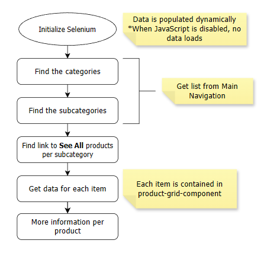
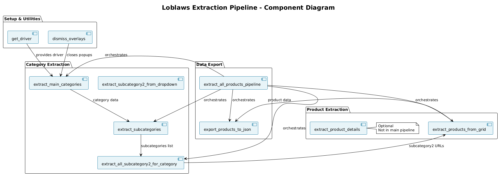
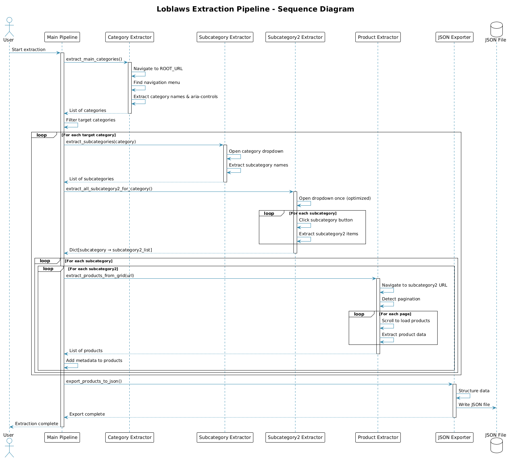

# Loblaws Data Extraction Pipeline

A comprehensive web scraping tool for extracting product data from Loblaws.ca using Selenium. This project extracts product information including categories, subcategories, and detailed product data (titles, prices, sizes, URLs) from the Loblaws e-commerce website.

## 📋 Table of Contents

- [Features](#features)
- [Requirements](#requirements)
- [Installation](#installation)
- [Usage](#usage)
- [Project Structure](#project-structure)
- [Pipeline Overview](#pipeline-overview)
- [Architecture Diagrams](#architecture-diagrams)
- [Configuration](#configuration)
- [Output Format](#output-format)
- [Troubleshooting](#troubleshooting)

## ✨ Features

- **Hierarchical Category Extraction**: Extracts main categories, subcategories, and subcategory2 items
- **Product Data Extraction**: Collects product titles, prices, package sizes, and URLs
- **Pagination Support**: Automatically handles multi-page product listings
- **Optimized Batch Processing**: Efficiently extracts subcategory2 items in batch to minimize page navigation
- **Error Handling**: Robust error handling with detailed error logging
- **JSON Export**: Exports structured data to JSON format with extraction statistics
- **Test Functions**: Individual test functions for each extraction step

## 🔧 Requirements

- Python 3.7+
- Google Chrome browser
- ChromeDriver (compatible with your Chrome version)
- Selenium 4.0+

## 📦 Installation

1. **Clone or download this repository**

2. **Install Python dependencies**:
   ```bash
   pip install selenium
   ```

3. **Install ChromeDriver**:
   - Download ChromeDriver from [ChromeDriver Downloads](https://chromedriver.chromium.org/downloads)
   - Ensure ChromeDriver is in your system PATH, or place it in the project directory
   - Verify your ChromeDriver version matches your Chrome browser version

## 🚀 Usage

### Running the Full Pipeline

Open `get_data.ipynb` in Jupyter Notebook and execute the cells in order:

1. **Install dependencies** (Cell 0):
   ```python
   %pip install -U selenium
   ```

2. **Run the main pipeline** (Cell 26):
   ```python
   # Initialize driver and wait
   driver = get_driver(headless=False)
   wait = WebDriverWait(driver, MAX_WAIT)

   try:
       # Run the pipeline
       stats = extract_all_products_pipeline(
           driver, 
           wait, 
           output_file="loblaws_products.json",
           debug=False  # Set to True for detailed debug output
       )
       
       print("\n✓ Pipeline execution completed!")
       
   except Exception as e:
       print(f"\n✗ Pipeline execution failed: {e}")
       import traceback
       traceback.print_exc()
   finally:
       driver.quit()
       print("\n✓ Driver closed")
   ```

### Testing Individual Functions

The notebook includes test cells for each extraction function:

- **Test Main Categories** (Cell 6): Tests `extract_main_categories()`
- **Test Subcategories** (Cell 8): Tests `extract_subcategories()`
- **Test Subcategory2** (Cell 12): Tests `extract_subcategory2_from_dropdown()`
- **Test Product Extraction** (Cell 13): Tests `extract_products_from_grid()`

### Running in Headless Mode

To run the pipeline without opening a browser window:

```python
driver = get_driver(headless=True)
```

## 📁 Project Structure

```
loblaws/
├── get_data.ipynb              # Main notebook with extraction pipeline
├── get_data.html               # HTML version of the notebook
├── get_data.pdf                # PDF version of the notebook
├── loblaws_products.json        # Output: Extracted product data
├── diagrams/                    # Pipeline diagrams
│   ├── concept.png              # High-level architecture overview
│   ├── component_diagram.png   # Component relationships
│   └── sequence_diagram.png    # Execution flow sequence
└── README.md                    # This file
```

## 🔄 Pipeline Overview

The extraction pipeline follows this hierarchical structure:

```
Main Categories (e.g., GROCERY, HOME, BEAUTY & BABY)
  └── Subcategories (e.g., Fruits & Vegetables, Dairy & Eggs)
      └── Subcategory2 (e.g., Fresh Vegetables, Milk & Cream)
          └── Products (with title, price, size, URL)
```

### Pipeline Steps

1. **Initialize WebDriver**: Creates Chrome WebDriver instance
2. **Extract Main Categories**: Gets top-level navigation categories
3. **Filter Target Categories**: Filters for specified categories (GROCERY, HOME, BEAUTY & BABY)
4. **Extract Subcategories**: For each category, extracts subcategories from dropdown menu
5. **Batch Extract Subcategory2**: Optimized batch extraction of all subcategory2 items
6. **Extract Products**: For each subcategory2 URL:
   - Navigates to product listing page
   - Handles pagination (extracts from all pages)
   - Scrolls to load lazy-loaded products
   - Extracts product data (title, price, size, URL)
7. **Add Metadata**: Adds category hierarchy to each product
8. **Export to JSON**: Saves structured data to JSON file

### Key Functions

- `extract_main_categories()`: Extracts main navigation categories
- `extract_subcategories()`: Extracts subcategories for a given category
- `extract_all_subcategory2_for_category()`: Batch extracts all subcategory2 items (optimized)
- `extract_products_from_grid()`: Extracts products from product listing pages with pagination support
- `extract_product_details()`: Optional function to extract detailed product information (nutrition, description, disclaimer)
- `extract_all_products_pipeline()`: Main pipeline orchestrator function

## 🏗️ Architecture Diagrams

The following diagrams illustrate the architecture and flow of the extraction pipeline:

### Concept Diagram

The image below provides a high-level overview of the pipeline architecture and data flow. It shows the overall structure of the extraction process, from initialization through data export.



### Component Diagram

The component diagram illustrates the relationships between different functions and modules in the pipeline:



**Key Components:**
- **Setup & Utilities**: WebDriver initialization and overlay dismissal
- **Category Extraction**: Functions for extracting categories, subcategories, and subcategory2 items
- **Product Extraction**: Functions for extracting product data from listing pages
- **Data Export**: Functions for structuring and exporting data to JSON

### Sequence Diagram

The sequence diagram shows the detailed execution flow and interactions between components:



**Execution Flow:**
1. User initiates the pipeline
2. Main pipeline orchestrates the extraction process
3. Category extractor retrieves main categories
4. Subcategory extractor processes each category
5. Subcategory2 extractor performs batch extraction
6. Product extractor handles pagination and product data extraction
7. JSON exporter structures and saves the data

## ⚙️ Configuration

### Target Categories

Modify `TARGET_CATEGORIES` in the notebook to extract different categories:

```python
TARGET_CATEGORIES = ["GROCERY", "HOME, BEAUTY & BABY"]
```

### Timeout Settings

Adjust `MAX_WAIT` for different network conditions:

```python
MAX_WAIT = 60  # seconds
```

### Output File

Specify the output JSON file path:

```python
output_file="loblaws_products.json"
```

## 📊 Output Format

The pipeline generates a JSON file with the following structure:

```json
{
  "extraction_date": "2025-12-10 19:09:55",
  "categories_processed": ["GROCERY", "HOME, BEAUTY & BABY"],
  "statistics": {
    "categories_processed": 2,
    "subcategories_processed": 30,
    "subcategory2_processed": 157,
    "total_products": 5000,
    "errors": []
  },
  "products": [
    {
      "product-title": "Product Name",
      "regular-price": "$9.99",
      "product-package-size": "500 g, $1.99/100g",
      "product-url": "https://www.loblaws.ca/en/product/...",
      "category": "GROCERY",
      "subcategory": "Dairy & Eggs",
      "subcategory2": "Milk & Cream"
    }
  ]
}
```

### Product Fields

- `product-title`: Product name
- `regular-price`: Product price (may include sale price)
- `product-package-size`: Package size and unit price
- `product-url`: Direct link to product page
- `category`: Main category name
- `subcategory`: Subcategory name
- `subcategory2`: Subcategory2 name

## 🔍 Troubleshooting

### ChromeDriver Issues

- **Error**: `selenium.common.exceptions.WebDriverException`
- **Solution**: Ensure ChromeDriver version matches your Chrome browser version
- **Check version**: `chrome://version/` in Chrome browser

### Timeout Errors

- **Error**: `TimeoutException`
- **Solution**: Increase `MAX_WAIT` value or check internet connection
- **Alternative**: The pipeline includes retry logic and error handling

### Element Not Found

- **Error**: `NoSuchElementException`
- **Solution**: The website structure may have changed. Check selectors in the code
- **Debug**: Enable `debug=True` in pipeline function to see detailed extraction logs

### Empty Results

- **Issue**: No products extracted
- **Check**: 
  - Verify target categories exist on the website
  - Check if website structure has changed
  - Enable debug mode to see extraction progress

### Pagination Issues

- **Issue**: Products from later pages not extracted
- **Solution**: The pipeline automatically detects pagination. If issues persist, check pagination selectors

## 📈 Performance Notes

- **Batch Processing**: The pipeline uses optimized batch extraction for subcategory2 items to minimize page navigation
- **Pagination**: Automatically handles multi-page product listings
- **Lazy Loading**: Includes scrolling logic to load lazy-loaded products
- **Error Recovery**: Continues processing even if individual items fail

## 📝 Notes

- The extraction process may take significant time depending on the number of products
- Running in non-headless mode (`headless=False`) allows you to monitor the extraction process
- The pipeline includes comprehensive error handling and logging
- Individual test functions are available for debugging specific extraction steps

## 🔗 Additional Resources

For more detailed visualizations of the pipeline architecture, refer to the diagrams in the `diagrams/` directory:
- `concept.png`: High-level architecture and data flow overview
- `component_diagram.png`: Detailed component relationships and dependencies
- `sequence_diagram.png`: Step-by-step execution flow and component interactions

## ⚠️ Disclaimer

This tool is for educational and research purposes. Please ensure compliance with:
- Loblaws Terms of Service
- Website robots.txt
- Rate limiting and respectful scraping practices
- Applicable data protection and privacy laws

## 📄 License

This project is provided as-is for educational purposes.

